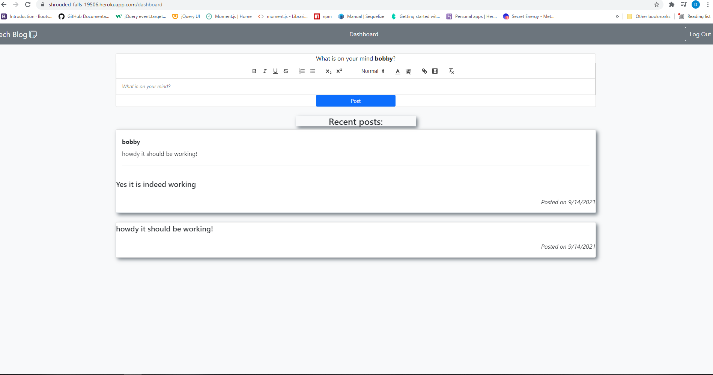

# ORM-E-Commerce
  
## Application Screenshot

## Description
- The Tech Blog is a CMS blog site for developers who write about Tech. The homepage displays all the blog posts for the site. Users can sign-up, log in, create, edit and delete blog posts. One can also post comments on other users' posts. Each user has a personalized dashboard that displays their posts with a form to create new posts.
- This project follows the Model-View-Controller architectural paradigm. Bcrypt and Dotenv npm package           installations secure passwords and the database.

- [Heroku live deployment](https://shrouded-falls-19506.herokuapp.com/login)
- [GitHub](https://github.com/selden-CBC2021/MVC-TechBlog)
## Table of Contents
  - [Usage](#usage)
  - [Credits](#credits)
  - [License](#license)
## Installation
## Usage
  --Type 'node server.js' to begin listening on your localhost (which ever port you designated in the .env file)
## License
  --https://opensource.org/licenses/MIT
   
  --This application is covered under the MIT license.
  ## How to Contribute
  --Feel free to contact me via the links below
  ## Tests
  --None. API endpoints were tested in postman
  ## Questions
  --My GitHub account is https://github.com/selden-CBC2021

  --If you have any questions please email me at seldend1@gmail.com
  

